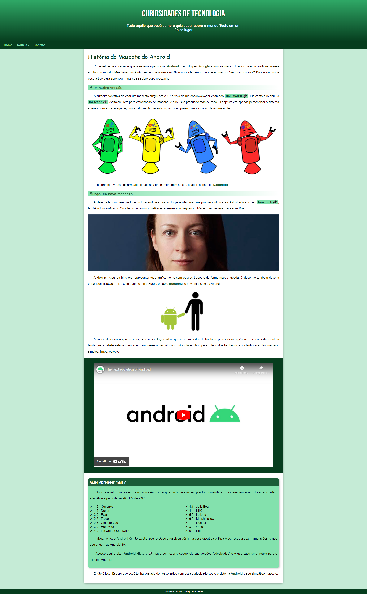

<h1 align="center"> Projeto Android </h1>

Projeto desenvolvido através dos vídeos do Professor Gustavo Guanabara, promovido pelo Curso em Vídeo para ensino de tecnologias WEB.

  <a href="#-tecnologias">Tecnologias</a>&nbsp;&nbsp;&nbsp;|&nbsp;&nbsp;&nbsp;
  <a href="#-projeto">Projeto</a>&nbsp;&nbsp;&nbsp;|&nbsp;&nbsp;&nbsp;
  <a href="#-layout">Layout</a>&nbsp;&nbsp;&nbsp;|&nbsp;&nbsp;&nbsp;
  <a href="#memo-licença">Licença</a>

 

  

## 🚀 Tecnologias

Esse projeto foi desenvolvido com as seguintes tecnologias:

- HTML5 
- CSS3

## 💻 Projeto

O Projeto Android é uma página da web que traz informações sobre a história do mascote do Android.

## 🔖 Layout

Você pode navegar pelo projeto através [DESSE LINK](https://thiagomonts.github.io/projeto-android/).

## :memo: Licença

Esse projeto está sob a licença MIT.

---

Desenvolvido por [Thiago Honorato](https://www.linkedin.com/in/honoratothiago/)
